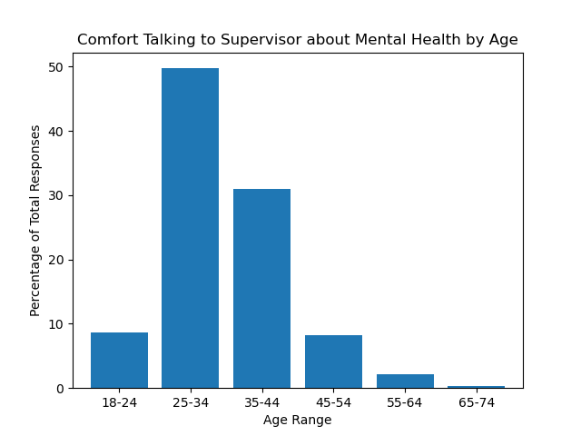

#  Mental Health in Tech Jobs: A Study of How Comfortable Employees in the Tech Field are Discussing Mental Health with their Employers.
## Project Overview
### Team members:
- Matthew Idle, Chad Fletcher, Lori Vitaioli, Brady Ogega, Cindy Hansel, Heather Shoberg, Jennifer White
### Project Description:
- This project seeks to determine trends and relationships in tech industry employees’ comfort in discussing mental health with their employers. To do so, we will analyze survey data targeted towards employees in the tech industry around their mental health experiences in the workplace.
### Research Questions:
1. Which variables impact a technology employee's comfort/willingness to discuss mental health with employers?
2. Do employees feel more comfortable talking about physical or mental health?
3. What is the level of ease for taking a leave of absence for mental health in the tech industry?
### Datasets Used:
- https://osmihelp.org/research.html
- We utilized data sets for the 2016, 2017, 2018, and 2019 OSMI Mental Health in Tech surveys.
### Survey Questions Analyzed:
- What is your age?
- What is your gender?
- What country do you work in?
- Do you work remotely?
- How many employees does your company or organization have?
- Have you had a mental health disorder in the past?
- Do you currently have a mental health disorder?
- Would you be willing to bring up a physical health issue with a potential employer in an interview?
- Would you bring up a mental health issue with a potential employer in an interview?
- Have you observed or experienced an unsupportive or badly handled response to a mental health issue in your current or previous workplace?*
- Have your observations of how another individual who discussed a mental health disorder made you less likely to reveal a mental health issue yourself in your current workplace?*
- Would you feel comfortable discussing a mental health disorder with your direct supervisor(s)?
- Would you have been willing to discuss a mental health issue with your direct supervisor(s)?*
- If a mental health issue prompted you to request a medical leave from work, asking for that leave would be:
- Has your employer ever formally discussed mental health (for example, as part of a wellness campaign or other official communication)?
### Data Cleanup:
- Data cleanup can be found in two sets of code: Project-1.ipynb for cleaning only the 2016 survey and clean_2016-2019.ipynb for cleaning and merging all of the surveys. 
- Filtered the survey questions to the ones we were interested in analyzing. Renamed these columns from questions to shortened names to easily call them into code later. 
- Cleaned the age column by looking at ages between 18 to 98, which removed some outliers (3 years old, 99 years old, 323 years old). We then created bins to group the ages into ranges (18-24, 25-34, 35-44, 45-54, 55-64, 65-74, 75+).
- The original gender question in the surveys allowed for open-ended responses, which resulted in there being hundreds of options for gender in the survey. To allow for easier analysis of the data based on gender, we created three overarching gender categories: male, female, and other. We conducted research to determine where to best place the various responses. We did omit responses that did not align with a gender grouping, such as "nan", "none of your business", "I am a Wookie", and "God King of the Valajar". A list of the original gender responses and which category they were placed under can be found in the project presentation appendix. 
- For blank responses, we utilized the "fillna" function and filled those with "No Response" as those we intentionally left blank by survey respondents.
### Methodology
- For research question 1, we decided to look at the 2016 survey as this survey had the largest number of responses, so we felt it would be a better representation of the tech industry's workforce.
- Project team members each analyzed a different demographic variable (gender, age range, company size, the country worked in, remote work or not, current mental health diagnosis, and previous mental health diagnosis) and the question "Would you feel comfortable discussing a mental health disorder with your direct supervisor(s)?" to answer the research question.
- For questions 2 and 3, the surveys for 2016, 2017, 2018, and 2019 were combined into one data frame to be able to look at data over time.
- Some issues we encountered when cleaning and analyzing the data included: the open-ended response for gender, inconsistency in the number of questions in the various surveys as well as the total number of responses (which decreased over time), inconsistency with the phrasing of questions from survey to survey, changing the responses options for questions from survey to survey, and the most recent survey (2019) did not include a question around remote workers.
## Research Question 1 Analysis: Which variables impact a technology employee's comfort/willingness to discuss mental health with employers?
- Team members created code for analyzing different demographics and their relationship to the question "Would you feel comfortable discussing a mental health disorder with your direct supervisor(s)?"
### Gender: 
- One variable analyzed in relation to comfort in discussing mental health with an employer was gender. We sought to determine if one gender grouping was more likely to feel comfortable discussing mental health with an employer than another. 
- Our hypothesis was that female respondents would feel more comfortable discussing mental health with an employer than male and other respondents. 
- Our null hypothesis was that there would be no difference between the gender groupings in terms of comfort in discussing mental health with an employer.
- The bar chart below was created by analyzing the "gender" and "comf_discuss_mh_disorder_cur_superv" columns in the "2016-cleaned.csv". We determined that it was best to look at the proportions of responses to the questions instead of the counts due to the unbalanced number of respondents by gender grouping. There were 1052 male respondents, 340 female respondents, and 31 other gender respondents. Looking at the percentages of responses for each gender grouping made it easier to compare the groups to each other. 
- The first observation made when looking at the gender graph was that the three gender groupings' responses seemed to trend in the same direction: "yes" is the highest proportion response, followed by "maybe", then "no", and finally "no response" is the lowest proportion response. Additionally, the percentages of respondents saying "yes", "no", and "maybe" by gender grouping were very close to each other, with the largest difference being 4% between female respondents and other respondents in the maybe category. 
- To accept our hypothesis, we would have needed to see lower proportions of male and other gender respondents answering "yes" and higher proportions of those same two groups responding "no" or "maybe". Based on our observations of the data, we do not see a large difference in the proportion of "yes" responses to the question. Therefore, we reject our hypothesis and accept our null hypothesis.
- To answer the research question, the gender of respondents does not seem to have a noticeable impact on a technology employee’s comfort in discussing mental health with their employer.
- Reference Chart Below:
- 
### Age Range:
- X
### Company Size:
- X
### Country Worked In:
- X
### Remote Work: 
- According to the data, there is not a strong correlation between working remotely and the employee's comfort/willingness to discuss mental health with employers. But the data does show that workers who never work remotely had the lowest amount of 'No' responses, which may show that showing up to work in person could have a small impact on the comfort/willingness to discuss mental health with their supervisor.
- Reference Chart Below:
- 
### Current and Previous Diagnosis:
- X
## Research Question 2 Analysis: Do employees feel more comfortable talking about physical or mental health?
- Team members created code for analyzing the percentage of respondents who said "Yes" to the following questions:
- Would you be willing to bring up a physical health issue with a potential employer in an interview?
- Would you bring up a mental health issue with a potential employer in an interview?
- These percentages were compared over time to see if there were changes in the level of comfort discussing a physical vs mental health issue with employers over time.
## Research Question 3 Analysis: What is the level of ease for taking a leave of absence for mental health in the tech industry?
- Team members created code to analyze the level of ease in requesting time off for mental health.
## Final Conclusions:
1. Which variables impact a technology employee's comfort/willingness to discuss mental health with employers?
  1. **Gender** does not have a correlation to comfort in discussing mental health with employers
  2. **Remote Work** does not have a correlation to comfort in discussing mental health with employers
3. Do employees feel more comfortable talking about physical or mental health?
4. What is the level of ease for taking a leave of absence for mental health in the tech industry?
  4. Negative correlation between difficulty requesting medical leave for mental health and comfort talking with an employer about mental health. As it becomes more difficult to ask for medical leave for mental health, employees are less likely to talk to their employer about mental health. 
