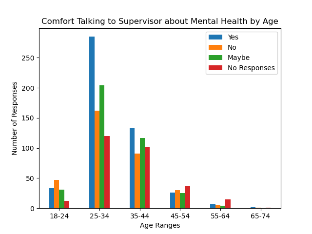
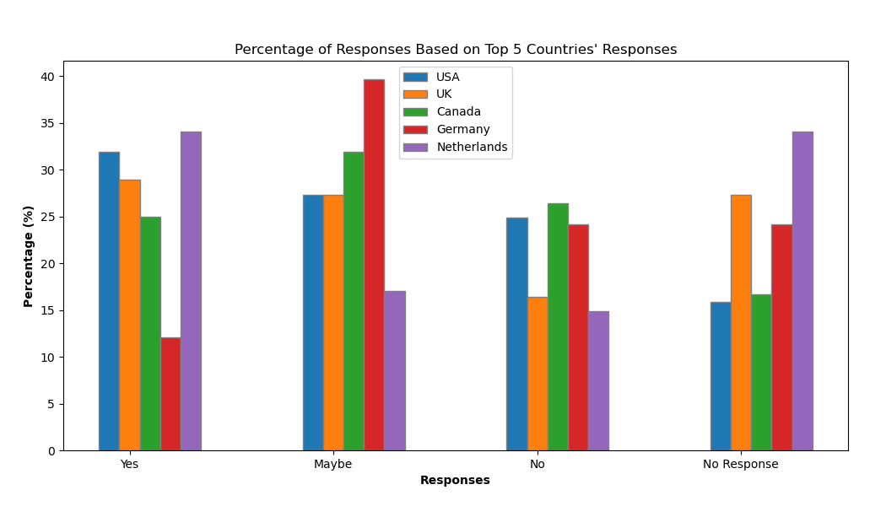
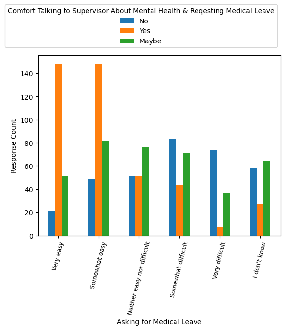

#  Mental Health in Tech Jobs: A Study of How Comfortable Employees in the Tech Field are Discussing Mental Health with their Employers.
## Project Overview
### Team members:
- Matthew Idle, Chad Fletcher, Lori Vitaioli, Brady Ogega, Cindy Hansel, Heather Shoberg, Jennifer White
### Project Description:
- This project seeks to determine trends and relationships in tech industry employees’ comfort discussing mental health with their employers. To do so, we will analyze survey data targeted towards employees in the tech industry around their mental health experiences in the workplace.
### Research Questions:
1. Which variables impact a technology employee's comfort/willingness to discuss mental health with employers?
2. Do employees feel more comfortable talking about physical or mental health?
3. What is the level of ease for taking a leave of absence for mental health in the tech industry?
### Datasets Used:
- https://osmihelp.org/research.html
- We utilized data sets for the 2016, 2017, 2018, and 2019 OSMI Mental Health in Tech surveys.
### Survey Questions Analyzed:
- What is your age?
- What is your gender?
- What country do you work in?
- Do you work remotely?
- How many employees does your company or organization have?
- Have you had a mental health disorder in the past?
- Do you currently have a mental health disorder?
- Would you be willing to bring up a physical health issue with a potential employer in an interview?
- Would you bring up a mental health issue with a potential employer in an interview?
- Have you observed or experienced an unsupportive or badly handled response to a mental health issue in your current or previous workplace?
- Have your observations of how another individual who discussed a mental health disorder made you less likely to reveal a mental health issue yourself in your current workplace?
- Would you feel comfortable discussing a mental health disorder with your direct supervisor(s)?
- Would you have been willing to discuss a mental health issue with your direct supervisor(s)?
- If a mental health issue prompted you to request a medical leave from work, asking for that leave would be:
- Has your employer ever formally discussed mental health (for example, as part of a wellness campaign or other official communication)?
### Data Cleanup:
- Data cleanup can be found in two sets of code: Project-1.ipynb for cleaning only the 2016 survey and clean_2016-2019.ipynb for cleaning and merging all of the surveys. 
- Filtered the survey questions to the ones we were interested in analyzing. Renamed these columns from questions to shortened names to easily call them into code later.
- 
- Cleaned the age column by looking at ages between 18 to 98, which removed some outliers (3 years old, 99 years old, 323 years old). We then created bins to group the ages into ranges (18-24, 25-34, 35-44, 45-54, 55-64, 65-74, 75+).
- 
- 
- The original gender question in the surveys allowed for open-ended responses, which resulted in there being hundreds of options for gender in the survey. To allow for easier analysis of the data based on gender, we created three overarching gender categories: male, female, and other. We conducted research to determine where to best place the various responses. We did omit responses that did not align with a gender grouping, such as "nan", "none of your business", "I am a Wookie", and "God King of the Valajar". A list of the original gender responses and which category they were placed under can be found in the project presentation appendix.
- 
- 
- 
- For blank responses, we utilized the "fillna" function and filled those with "No Response" as those we intentionally left blank by survey respondents.
- 
### Methodology
- For research question 1, we decided to look at the 2016 survey as this survey had the largest number of responses, so we felt it would be a better representation of the tech industry's workforce.
- Project team members each analyzed a different demographic variable (gender, age range, company size, the country worked in, remote work or not, current mental health diagnosis, and previous mental health diagnosis) and the question "Would you feel comfortable discussing a mental health disorder with your direct supervisor(s)?" to answer the research question.
- For questions 2 and 3, the surveys for 2016, 2017, 2018, and 2019 were combined into one data frame to be able to look at data over time.
- Some issues we encountered when cleaning and analyzing the data included: the open-ended response for gender, inconsistency in the number of questions in the various surveys as well as the total number of responses (which decreased over time), inconsistency with the phrasing of questions from survey to survey, changing the responses options for questions from survey to survey, and the most recent survey (2019) did not include a question around remote workers.
## Research Question 1 Analysis: Which variables impact a technology employee's comfort/willingness to discuss mental health with employers?
- Team members created code for analyzing different demographics and their relationship to the question **"Would you feel comfortable discussing a mental health disorder with your direct supervisor(s)?"**
### Gender: 
- Code for gender analysis can be found here: 2016_data_explore_gender.ipynb
- One variable analyzed in relation to comfort in discussing mental health with an employer was gender. We sought to determine if one gender grouping was more likely to feel comfortable discussing mental health with an employer than another. 
- Our hypothesis was that female respondents would feel more comfortable discussing mental health with an employer than male and other respondents. 
- Our null hypothesis was that there would be no difference between the gender groupings in terms of comfort in discussing mental health with an employer.
- The bar chart below was created by analyzing the "gender" and "comf_discuss_mh_disorder_cur_superv" columns in the "2016-cleaned.csv". We determined that it was best to look at the proportions of responses to the questions instead of the counts due to the unbalanced number of respondents by gender grouping. There were 1052 male respondents, 340 female respondents, and 31 other gender respondents. Looking at the percentages of responses for each gender grouping made it easier to compare the groups to each other. 
- The first observation made when looking at the gender graph was that the three gender groupings' responses seemed to trend in the same direction: "yes" is the highest proportion response, followed by "maybe", then "no", and finally "no response" is the lowest proportion response. Additionally, the percentages of respondents saying "yes", "no", and "maybe" by gender grouping were very close to each other, with the largest difference being 4% between female respondents and other respondents in the maybe category. 
- To accept our hypothesis, we would have needed to see lower proportions of male and other gender respondents answering "yes" and higher proportions of those same two groups responding "no" or "maybe". Based on our observations of the data, we do not see a large difference in the proportion of "yes" responses to the question. Therefore, we reject our hypothesis and accept our null hypothesis.
- To answer the research question, the gender of respondents does not seem to have a noticeable impact on a technology employee’s comfort in discussing mental health with their employer.
- Reference Chart Below:
- 
### Age Range:
- Looking at the bar graph with regards to how comfortable someone feels talking to their supervisor about mental health, the conclusion can be drawn that age is not a factor, or at least very little of a factor.
- A knee-jerk reaction is to look at the 25-34 age range and think you have a conclusion dead to rights, but what you have is just a lot more responses to the survey from the 25-34 age group. There is a slight overall uptick in the 25-34 age group responding with yes, but I don't think it's enough to draw any conclusions.
- As we move our eyes over yonder to the box plot, the first thing that we notice are the bright red outliers. The median and interquartile range is nearly the same across the board, which can largely be attributed to the heavy showing from the 25-34 age range. Nothing noticeable stands out, with the exception of the outliers, but I attribute this to the avalanche of the 25-34 age group, and the fact that the sidewalk has to stop someplace.
- - Reference Charts Below:
- 
- 
### Company Size:
- The bar chart visualization shows the relationship between company size on the x-axis vs their response on the y-axis.
- 3 out of the 6 company sizes had “Yes” as their most popular answer.
- 2 out of the 6 company sizes had “Maybe” as their most popular answer
- Just 1 company size had “No” as their most popular answer
- Companies with 25 or less employees were more likely to discuss mental health with their director supervisor than not.
- Companies with over 1000 employees were less likely to discuss mental health with their director supervisor
- As company size grew the amount of No’s decreased and Maybe’s increased. Companies with large employee populations tend to show a more uncertain attitude when discussing mental health with a superior.
- Reference Chart Below:
- 
### Country Worked In:
- The top 5 countries with the most survey responses were used for the analysis portion due to many countries having a very small amount of respondents.
- Participants were asked if they would feel comfortable talking to their supervisor about mental health, and it was explored as to whether or not there is any correlation between where a person works and level of comfort.
- The USA has a strong negative correlation, suggesting there is less comfort in talking to a supervisor about mental health.
- The Netherlands had a very weak negative correlation on the other end of the spectrum suggesting a very weak relationship between country and comfort level.
- Further analysis would need to be done to truly understand the nature of the relationship.
- Reference Charts Below:
- 
- 
### Remote Work: 
- According to the data, there is not a strong correlation between working remotely and the employee's comfort/willingness to discuss mental health with employers. But the data does show that workers who never work remotely had the lowest amount of 'No' responses, which may show that showing up to work in person could have a small impact on the comfort/willingness to discuss mental health with their supervisor.
- Reference Chart Below:
- 
### Current and Previous Diagnosis:
- Employees appear to be more comfortable talking with their employer if they have a previous mental health diagnosis or a possible previous mental health diagnosis.
- Reference Charts Below:
- 
- 
## Research Question 2 Analysis: Do employees feel more comfortable talking about physical or mental health?
- Team members created code for analyzing the percentage of respondents who said "Yes" to the following questions:
- Would you be willing to bring up a physical health issue with a potential employer in an interview?
- Would you bring up a mental health issue with a potential employer in an interview?
- These percentages were compared over time to see if there were changes in the level of comfort discussing a physical vs mental health issue with employers over time.
- For this question we looked at the combined dataset from years 2016, 2017, 2018 and 2019. We chose this question inferring there may be a stigma associated with mental health issues that is stronger than that of physical health issues.
### Overall:
-When observing the following graphed data, we see there is a large delta between those that would bring up a mental health issue in an interview and those that would bring up a physical health issue in an interview. Employees are less likely to bring up a mental health issue versus a physical issue. There were just over 6% that would bring up mental health issues and approximately 24% that would bring up physical health issues. There exists an even stronger difference when observing the "No" answers, with mental health at over 65% and physical health just under 34%.
- 
### Timeline:
- There is not a significant trend over the years we observed, as both physical health and mental health stay fairly steady. Additionally, it is clear that the differences between the two, physical health and mental health, remain large. This indicates a stronger stigma toward bringing up mental health issues than bringing up physical health issues.
- 
## Research Question 3 Analysis: What is the level of ease for taking a leave of absence for mental health in the tech industry?
- Team members created code to analyze the level of ease in requesting time off for mental health.
- For this question we looked at the combined dataset from years 2016, 2017, 2018 and 2019. We chose this question to observe if there were any trends in this area. It is an area where we might see stigma associated with mental health and the hesitation to discuss the subject or, in this case, request a leave of absence.
### Overall:
- Observing the entire combined dataset, we see that there is a stronger sense of ease toward asking for a leave than sense of difficulty. Over 38% indicated it would be easy to ask for a leave versus under 20% that would find it to be difficult.
- 
### Timeline:
- Notably, the gap between a leave request being easy and being difficult grows over time. The percentages showing it being easy rise as the percentages showing it being difficult drop slightly over the 4 year span. In 2016, the difference in those indicating it being easy and those indicating it being difficult was 12.81%, while that difference in 2019 was 23.93%.
- 
### Compare respondent’s comfort talking to current supervisor about mental health issues and how easy it is to take medical leave:
- According to the 2016 data, the easier it is to request medical leave, the more likely respondents felt comfortable talking to their supervisor about mental health.
- Reference Chart Below:
- 
## Employer Discussion of Mental Health Effect on Comfort Level of Requesting Leave
- For this topic we looked at whether or not the employer has officially discussed mental health with the respondent. We chose the combined dataset, 2016-2019 to analyze. The asumption was that if the answer was "Yes," that would make it easier for an employee to request a leave of absence because of a mental health issue. 
- As we observe in the following chart, the "Yes" responses (orange) tend toward the "Somewhat easy" category, while the "No" responses (blue) tend toward category "Neither easy nor difficult." This can be seen by the respective orange and blue mean lines. This indicates that if the employer discusses mental health with the employee, that employee is more likely to feel comfortable requesting a leave of absence because of a mental health issue.
- 

## Final Conclusions:
### Which variables impact a technology employee's comfort/willingness to discuss mental health with employers?
1. **Gender** does not have a correlation to comfort in discussing mental health with employers
2. **Remote Work** does not have a correlation to comfort in discussing mental health with employers
3. **Age** does not have a correlation to comfort in discussing mental health with employers
4. **Current Mental Health Disorder** does not have a correlation to comfort in discussing mental health with employers
5. **Previous Mental Health Diagnosis** has a positive correlation to comfort in discussing mental health with employers. Employees with a previous or potential previous mental health diagnosis found it easier to talk with their employer about mental health.
6. **Country Correlations:** The USA has a strong negative correlation, suggesting there is less comfort in talking to a supervisor about mental health. The Netherlands had a very weak negative correlation on the other end of the spectrum suggesting a very weak relationship between country and comfort level.
7. **Company Size Correlations:** As company size grew the amount of No’s decreased and Maybe’s increased. Companies with large employee populations tend to show a more uncertain attitude when discussing mental health with a superior.
### Do employees feel more comfortable talking about physical or mental health?
1. There is a distinct gap between talking about mental health vs. physical health in an interview. Employees are more willing to discuss physical health than mental health. This stigma does not change significantly over time.
### What is the level of ease for taking a leave of absence for mental health in the tech industry?
1. There is a positive correlation between the ease of requesting medical leave for mental health and comfort in talking with an employer about mental health. As it becomes easier to ask for medical leave for mental health, employees are more likely to talk to their employer about mental health.
## Next Steps:
### Future Research Projects
- Impact of COVID on mental health of tech employees
- Impacts of Return to Work mandates or lack of RtW mandates
### Other Survey Questions to Consider
- Analyzing the types of mental health diagnoses that showed up in later data sets and how they relate to the other questions
### Suggestions for future surveys
- Add remote worker designation question back into the surveys
- The survey should include categories for gender so analysts do not have to determine gender categories, the respondents themselves can
- Keep the questions consistent, try to avoid changing the phrasing of the question and response options
- Response option for choosing not to answer
## Appendix
#### OSMI 2016 Survey Data
- https://osmi.typeform.com/report/Ao6BTw/U76z 
#### Help for chart legend issues: 
- https://matplotlib.org/stable/api/_as_gen/matplotlib.pyplot.legend.html
- https://stackoverflow.com/questions/35992492/savefig-cuts-off-title
#### Code for help making bar chart:
- https://pandas.pydata.org/pandas-docs/version/0.23.3/generated/pandas.DataFrame.plot.bar.html
#### Correlation Coefficients
- https://realpython.com/numpy-scipy-pandas-correlation-python/
#### Gender terminology
- https://www.uwmedicine.org/practitioner-resources/lgbtq/lgbtq-inclusion-glossary#:~:text=Assigned%20female%20at%20birth%2FAssigned,(assigned%20male%20at%20birth).
- https://www.verywellmind.com/what-does-cishet-mean-5219425
## Appendix - Gender Terms
#### Male
- 'Male', 'male', 'Male ', 'M', 'm', 'man', 'Cis male', 'Male.', 'Male (cis)', 'Man', 'Sex is male', 'cis male', 'Malr', 'Dude', "I'm a man why didn't you make this a drop down question. You should of asked sex? And I would of answered yes please. Seriously how much text can this take? ", 'mail', 'male ', 'Cis Male', 'cisdude', 'cis man', 'MALE', 'cis-male', 'Mail', 'cis hetero male', "male (hey this is the tech industry you're talking about)", 'Cis-male', 'Male, cis', 'cis male ', 'dude', 'Ostensibly Male', 'male, born with xy chromosoms', 'Malel', 'Cis-male', 'Cisgender male', 'SWM', 'Let\'s keep it simple and say "male"', 'Identify as male', 'Masculine', 'Cishet male', 'masculino', 'Make', 'CIS Male'
#### Female
- 'Female', 'female', 'I identify as female.', 'female ', 'Female assigned at birth ', 'F', 'Woman', 'f', 'Cis female ', 'Female ', 'woman', 'female/woman', 'Cisgender Female', 'fem', 'Female (props for making this a freeform field, though)', ' Female', 'Cis-woman', 'female-bodied; no feelings about gender', 'AFAB', 'fm', 'femalw', 'femail', 'female (cis)', 'My sex is female.', 'female (cisgender)', 'Female (cis) ', 'Woman-identified', 'cis-Female', 'cis female', 'F, cisgender', 'I identify as female', '*shrug emoji* (F)', 'Cis woman', 'Female (cisgender)', 'Cis-Female', 'Cisgendered woman', 'cisgender female', 'Female-identified', 'cis woman', 'femmina', 'Femile', 'Female (cis)'
#### Other
- 'Bigender', 'non-binary', 'Transitioned, M2F', 'Genderfluid (born female)', 'Other/Transfeminine', 'Female or Multi-Gender Femme', 'Androgynous', 'male 9:1 female, roughly', 'Other', 'nb masculine', 'genderqueer', 'Human', 'Genderfluid', 'Enby', 'genderqueer woman', 'mtf', 'Queer', 'Agender', 'Fluid', 'Male/genderqueer', 'Nonbinary', 'human', 'Unicorn', 'Male (trans, FtM)', 'Genderqueer', 'Genderflux demi-girl', 'Transgender woman', 'male/androgynous ', 'uhhhhhhhhh fem genderqueer?', 'Non-binary', 'Agender/genderfluid', 'Male-ish', 'Contextual', 'Non binary', 'Genderqueer demigirl', 'Genderqueer/non-binary', 'nonbinary', 'Female-ish', 'trans woman', 'Transfeminine', 'Male (or female, or both)', 'Trans man', 'transgender', 'non binary', 'Female/gender non-binary.', 'She/her/they/them', 'NB', 'Nonbinary/femme', 'gender non-conforming woman', 'Trans woman', 'genderfluid', 'Demiguy', 'none', 'Trans female', 'agender', 'Questioning', 'Agender trans woman', 'Trans non-binary/genderfluid', 'Non-binary and gender fluid'
