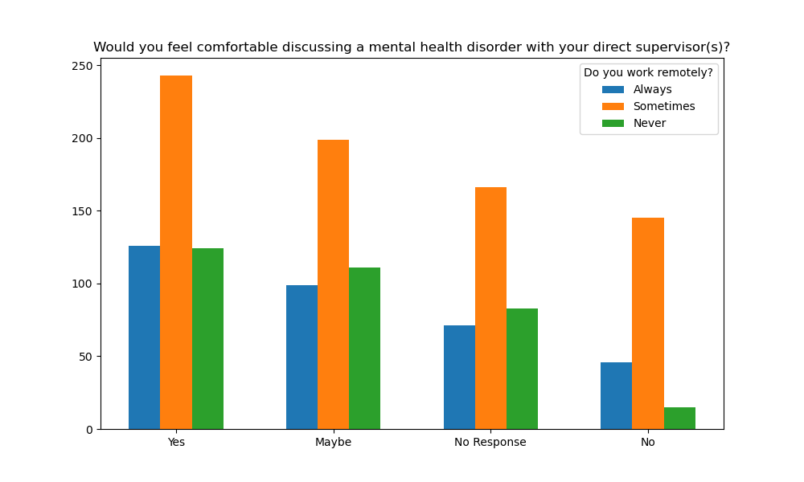

# Chad Remote Analysis

1. Which variables impact a technology employee's comfort/willingness to discuss mental health with employers?

Remote Work - According to the data, there is not a strong correlation between working remotely and the employee's comfort/willingness to discuss mental health with employers. But the data does show that workers who never work remotely had the lowest amount of 'No' responses, which may show that showing up to work in person could have a small impact on the comfort/willingness to discuss mental health with their supervisor.

Reference chart below:
